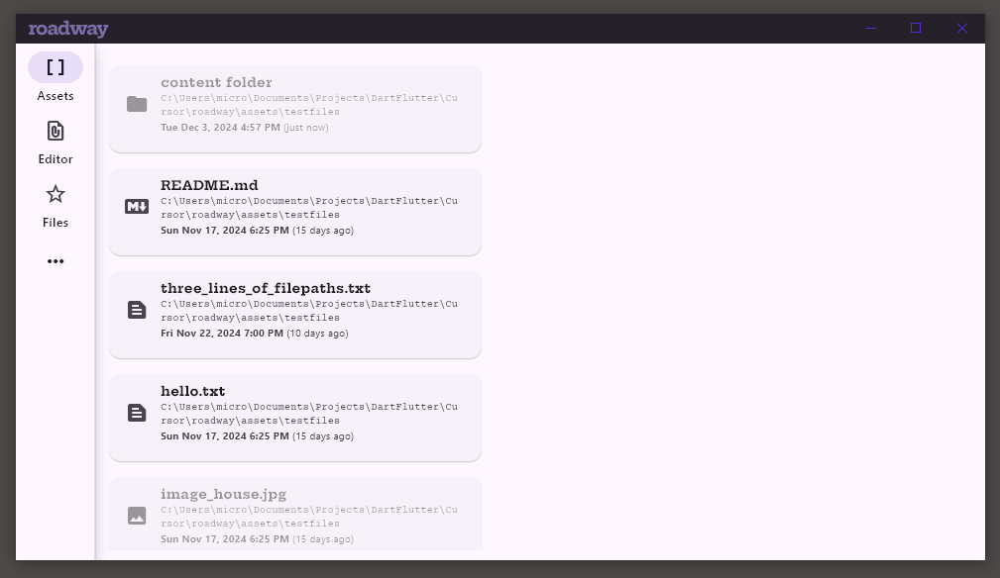

# Roadway

| *Productivity desktop tool that organizes assets.*



A project plan's **assets** are the files, websites, images, documents we collect and produce to guide a project. They are found in many locations on your computers and in the cloud. 

**Roadway** responds to the need to *see, associate* and *keep track* of these varied items that can simply be dragged into the app.

## Traditional asset management
Traditionally, the assets of a project plan imply their relationships to each other using:
* name
* location or path (URI hierarchy)
* metadata (in sidecar files or embedded)

The assets are renamed, tagged, modified and moved in order to move forward with a project. Every change to any of these assets constitutes a new version of the project.

Every change -- simply renaming one -- will break the relationships between assets.

Other problems:

(1) in structural cases:
* there are subprojects (which we will simply call a *project with relations*)
* projects can share common assets
* the folder structures are mirrored in file pathways within the assets, contributing to breakage
* mirrors of the project, typically as backups, but also for work sharing are not easily merged or compared

(2) in evolutionary cases:
* names get stale
* locations within organizational folders get stale, or worse, multiple locations are necessary to represent one-to-many attributes (see tagging)

(3) attributes
* incorrect tagging (spelling errors)
* semantic duplication in tags
* unnecessarily traits
* useless traits

**Roadway** can be thought of as a *bookmark organizer*, but with a few extra features:
* it **ingests** assets from multiple convenient places:
    * the file system
    * the clipboard
    * your browser
    * the cloud
* you can **view, edit** some of these
* you can make "file"-like objects that don't live on a file system
* you **relate** assets to each other
* you can **attach** notes on assets
* you can make **collections** of assets (by relating them)
* a **project is simply a view** of a subset of related assets

## Roadmap

### Movie assets
These need "sidecar" (ie. related) cue files to find specific clips, or to trim them. Possibly in a *caboose*.
* video file asset ingestion
* audio file asset ingestion
* video caption file asset ingestion

## Vibe Prompts

Here are some of the prompts used with *CursorAI*

```
In preparation for making the fileTree widget operational (it's using mock data right now) I want to add the the app state the "current working directory" (cwd) so that widgets like the fileTree can use the cwd as its initial location.

The app should persist cwd in the appData locally.

The app's navbar page "Tree" should have a bar across the top with the cwd shown there.

Dropping any file in this page should "cd" to that new cwd.

There should also be another appState called directoryVisits that is a list of objects that have a datetime stamp with that directory. It is kept ordered, most-recent-first. There should be no duplicates for a directory.

The cwdBar widget needs a popup menu at the right end of the bar of the DirectoryVisits. The menu items have the path and the "(2 hours ago)"-human-readable last-visit-time. (check for a utility function "getTimeAgo" in File.dart (refactor this if it is messy and should like separately.) Limit the menu length to the last three days or maximum 12 items.

Lastly, the big thing: change the fileTree to not use mock data, but rather the file system (filebrowser.dart might have working code for this but use the best approach.)

Extra credit if you can come up with a good way to cache the metadata for all the files -- gather this lazily if the app is idle. Use the file's lastModified date in order to check the cache's current validity, if its stale, schedule an update in the idle worker.

The type of metadata I want has been done previsously in filebrowser.dart, but as you can see, it uses file.statSync() which is not idea if we do this lazily... so just use this code as a guide for what types of metadata I want.

In particular, in the app there will be a place for viewing text files -- so, the file mimetype should be usable for detecting the ability to preview a file's contents as plain text versus JSON, or other text that should be syntax highlighted. 

Image file types should acquire the resolution (width, height).
```

---
(*) a caboose is a file "secretly" appended to another file (likely binary) to provide additional information about the file.
